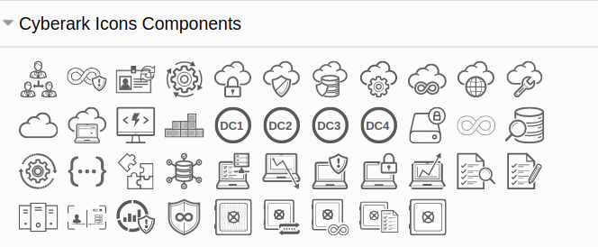
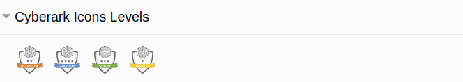
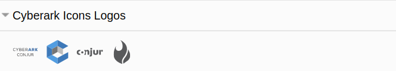
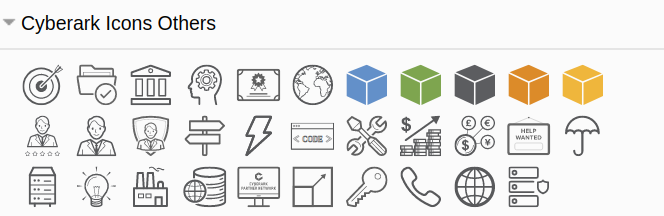
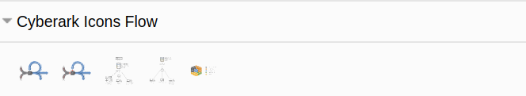
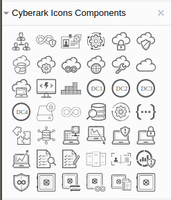

# Index

<!-- TOC -->

- [Index](#index)
- [1. Draw.io Libraries](#1-drawio-libraries)
    - [1.1. library-cyberark-Components-v1](#11-library-cyberark-components-v1)
    - [1.2. library-cyberark-Levels-v1](#12-library-cyberark-levels-v1)
    - [1.3. library-cyberark-Logos-v1](#13-library-cyberark-logos-v1)
    - [1.4. library-cyberark-Others-v1](#14-library-cyberark-others-v1)
    - [1.5. library-cyberark-Flow-v2](#15-library-cyberark-flow-v2)
- [2. Using a custom library](#2-using-a-custom-library)

<!-- /TOC -->

# 1. Draw.io Libraries

https://github.com/jgraph/drawio-libs/tree/master/

## 1.1. library-cyberark-Components-v1
- Library URL: https://raw.githubusercontent.com/CoolZeroNL/draw-io-plugins/master/%23%20Draw-io-Vector-Libraries/library-cyberark-Components-v1.xml  

<p align="center">
    
</p>

## 1.2. library-cyberark-Levels-v1
- Library URL: https://raw.githubusercontent.com/CoolZeroNL/draw-io-plugins/master/%23%20Draw-io-Vector-Libraries/library-cyberark-Levels-v1.xml  

<p align="center">
    
</p>

## 1.3. library-cyberark-Logos-v1
- Library URL: https://raw.githubusercontent.com/CoolZeroNL/draw-io-plugins/master/%23%20Draw-io-Vector-Libraries/library-cyberark-Logos-v1.xml  

<p align="center">
    
</p>

## 1.4. library-cyberark-Others-v1
- Library URL: https://raw.githubusercontent.com/CoolZeroNL/draw-io-plugins/master/%23%20Draw-io-Vector-Libraries/library-cyberark-Others-v1.xml  

<p align="center">
    
</p>

## 1.5. library-cyberark-Flow-v2
- Library URL: https://raw.githubusercontent.com/CoolZeroNL/draw-io-plugins/master/%23%20Draw-io-Vector-Libraries/library-cyberark-Flow-v2.xml

<p align="center">
    
</p>

- Flow
    - is created by hand...

# 2. Using a custom library

Let us add a custom library.

Go to `Select File` -> `Open library from` -> `URL`

<p align="center">
    
</p>

The URL popup will appear, here u enter the library url.

<p align="center">
    
</p>

Click on `Open` when u entered the url, and the library menu will appear.

<p align="center">
    
</p>

See also: https://desk.draw.io/support/solutions/articles/16000067790


<!-- Rule:
https://desk.draw.io/support/solutions/articles/16000079239

```
editableCssRules=.*;
```

1. create new libary
2. add SVG
3. save to device
4. click on the new added img (so that the image is selected and showing on drawing)
5. select the image
6. edit style
7. add `editableCssRules=.*;` after images;
8. click on apply
9. click on the + icon in the Libary -->