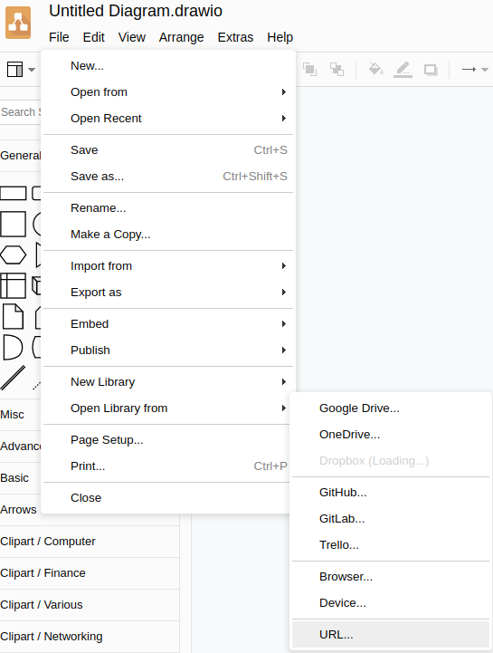
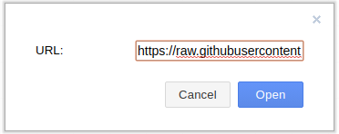

# Draw.io Libraries

https://github.com/jgraph/drawio-libs/tree/master/libs

! Work in Progress !

## library-cyberark-Components-v1
https://raw.githubusercontent.com/CoolZeroNL/draw-io-plugins/master/%23%20Draw-io-Vector-Libraries/library-cyberark-Components-v1.xml  

## library-cyberark-Levels-v1
https://raw.githubusercontent.com/CoolZeroNL/draw-io-plugins/master/%23%20Draw-io-Vector-Libraries/library-cyberark-Levels-v1.xml  

## library-cyberark-Logos-v1
https://raw.githubusercontent.com/CoolZeroNL/draw-io-plugins/master/%23%20Draw-io-Vector-Libraries/library-cyberark-Logos-v1.xml  

## library-cyberark-Others-v1
https://raw.githubusercontent.com/CoolZeroNL/draw-io-plugins/master/%23%20Draw-io-Vector-Libraries/library-cyberark-Others-v1.xml  
  
## library-cyberark-Flow-v2
https://raw.githubusercontent.com/CoolZeroNL/draw-io-plugins/master/%23%20Draw-io-Vector-Libraries/library-cyberark-Flow-v2.xml

- Flow
    - is created by hand...

# Using a custom library

Let us now add the custom library we created in the previous section.

Go to `Select File` -> `Open library from` -> `URL`

<p align="center">
    
</p>

The URL popup will appears, and we can add or library url.

<p align="center">
    
</p>

Click on Open when u entered the url, and the library menu will appear.

<p align="center">
    
</p>

See also: https://desk.draw.io/support/solutions/articles/16000067790


<!-- Rule:
https://desk.draw.io/support/solutions/articles/16000079239

```
editableCssRules=.*;
```

1. create new libary
2. add SVG
3. save to device
4. click on the new added img (so that the image is selected and showing on drawing)
5. select the image
6. edit style
7. add `editableCssRules=.*;` after images;
8. click on apply
9. click on the + icon in the Libary -->