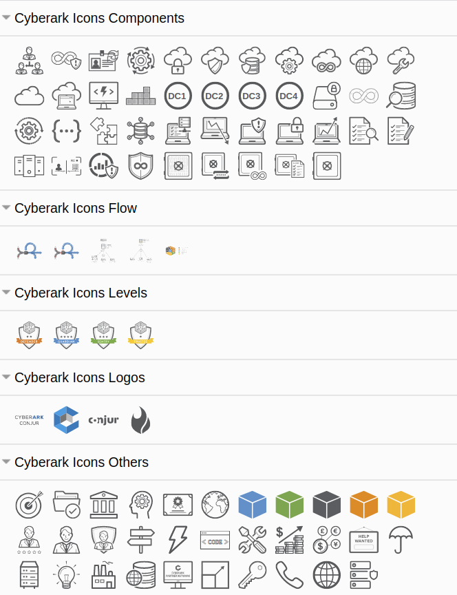

# Icons

  

URL for Draw.IO: https://yacdn.org/serve/https://raw.githubusercontent.com/CoolZeroNL/draw-io-plugins/master/%23%20Draw-io-plugin-Cyberark-Icons/draw-io-plugin-cyberark-icons-v1.js?maxAge=10

# Sorting

There will be created as many folders there is in `cyberark.images` an stencil in Draw.io

Place your images in the `cyberark.images` \ `subfolder` to have them embedded in a stencel within draw.io

# run

When there is an update of the images folder, run `01-create_xml-gen-v1.sh` to re-generate the plugin js file and the xml files for the sencil.