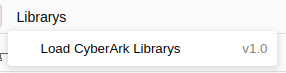

# 1. Index

<!-- TOC -->

- [1. Index](#1-index)
- [2. How to use:](#2-how-to-use)
    - [2.1. Load Automatic -> Using a plugin to load the library](#21-load-automatic---using-a-plugin-to-load-the-library)
        - [2.1.1. Plugin info:](#211-plugin-info)
    - [2.2. Load Manuel -> Manual load a custom library](#22-load-manuel---manual-load-a-custom-library)
- [3. Draw.io Libraries](#3-drawio-libraries)
    - [3.1. library-cyberark-Components-v1](#31-library-cyberark-components-v1)
    - [3.2. library-cyberark-Levels-v1](#32-library-cyberark-levels-v1)
    - [3.3. library-cyberark-Logos-v1](#33-library-cyberark-logos-v1)
    - [3.4. library-cyberark-Others-v1](#34-library-cyberark-others-v1)
    - [3.5. library-cyberark-Flow-v2](#35-library-cyberark-flow-v2)

<!-- /TOC -->


# 2. How to use:

## 2.1. Load Automatic -> Using a plugin to load the library
This will use the plugin functionality, and will load automatic all the cyberark Librarys into draw.io. With the menu you can activate them, and load them into your sidebar.

see: [https://github.com/CoolZeroNL/draw-io-plugins#22-installation-steps-drawio-online](https://github.com/CoolZeroNL/draw-io-plugins#22-installation-steps-drawio-online)

### 2.1.1. Plugin info:

- Plugin URL: https://yacdn.org/serve/https://raw.githubusercontent.com/CoolZeroNL/draw-io-plugins/master/%23%20Draw-io-plugin-Cyberark-Library/draw-io-plugin-cyberark-library-v0.1.js?maxAge=10

  - Will Do:
    - Add Menu: Librarys
      - Add Submenu: Load Cyberark Librarys
      
    - Add Library: 
      - Cyberark Icons

  After you have loaded the plugin, and you want want to load the Cyberark Librarys use the `Menu` -> `Librarys` -> `Load CyberArk Librarys`

  <p align="center">
    
</p>

## 2.2. Load Manuel -> Manual load a custom library
When you want to load individual Library into draw.io, use the next steps:

Let us add a custom library.

Go to `Select File` -> `Open library from` -> `URL`

<p align="center">
    
</p>

The URL popup will appear, here u enter the library url.

<p align="center">
    
</p>

Click on `Open` when u entered the url, and the library menu will appear.

<p align="center">
    
</p>

See also: https://desk.draw.io/support/solutions/articles/16000067790

# 3. Draw.io Libraries

https://github.com/jgraph/drawio-libs/tree/master/

## 3.1. library-cyberark-Components-v1
- Library URL: https://raw.githubusercontent.com/CoolZeroNL/draw-io-plugins/master/%23%20Draw-io-plugin-Cyberark-Library/library-cyberark-Components-v1.xml

<p align="center">
    
</p>

## 3.2. library-cyberark-Levels-v1
- Library URL: https://raw.githubusercontent.com/CoolZeroNL/draw-io-plugins/master/%23%20Draw-io-plugin-Cyberark-Library/library-cyberark-Levels-v1.xml  

<p align="center">
    
</p>

## 3.3. library-cyberark-Logos-v1
- Library URL: https://raw.githubusercontent.com/CoolZeroNL/draw-io-plugins/master/%23%20Draw-io-plugin-Cyberark-Library/library-cyberark-Logos-v1.xml  

<p align="center">
    
</p>

## 3.4. library-cyberark-Others-v1
- Library URL: https://raw.githubusercontent.com/CoolZeroNL/draw-io-plugins/master/%23%20Draw-io-plugin-Cyberark-Library/library-cyberark-Others-v1.xml  

<p align="center">
    
</p>

## 3.5. library-cyberark-Flow-v2
- Library URL: https://raw.githubusercontent.com/CoolZeroNL/draw-io-plugins/master/%23%20Draw-io-plugin-Cyberark-Library/library-cyberark-Flow-v2.xml

<p align="center">
    
</p>

- Flow
    - is created by hand...


<!-- Rule:
https://desk.draw.io/support/solutions/articles/16000079239

```
editableCssRules=.*;
```

1. create new libary
2. add SVG
3. save to device
4. click on the new added img (so that the image is selected and showing on drawing)
5. select the image
6. edit style
7. add `editableCssRules=.*;` after images;
8. click on apply
9. click on the + icon in the Libary -->


https://stackoverflow.com/questions/55119807/how-to-customize-mxgraph-toolbar-and-properties-panel