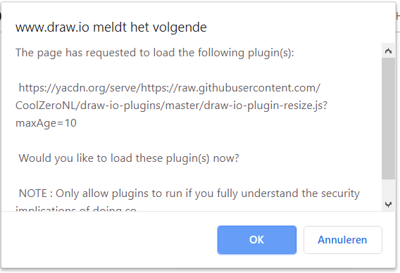

# 1. Index:

<!-- TOC -->

- [1. Index:](#1-index)
- [2. Installation of a Plugin:](#2-installation-of-a-plugin)
    - [2.1. Use of CORS Proxy:](#21-use-of-cors-proxy)
    - [2.2. Cors Proxy information:](#22-cors-proxy-information)
    - [2.3. Install Plugin Within Draw-io](#23-install-plugin-within-draw-io)
- [3. Plugins:](#3-plugins)
    - [3.1. Resize (height & width by selected cell)](#31-resize-height--width-by-selected-cell)
        - [3.1.1. Sample:](#311-sample)
    - [3.2. Reorder Childs:](#32-reorder-childs)
    - [3.3. SecurIT Huisstijl](#33-securit-huisstijl)

<!-- /TOC -->

# 2. Installation of a Plugin:

## 2.1. Use of CORS Proxy:
Because the plugins are been included within draw.io the browser will block this, because the plugin is not on the same domain as draw.io is. So the browser will give the next error: `Refused to execute script from 'https://raw.githubusercontent.com/CoolZeroNL/draw-io-plugins/master/draw-io-plugin-resize.js' because its MIME type ('text/plain') is not executable, and strict MIME type checking is enabled.` 

To fix this u need to use a CORS proxy server.

## 2.2. Cors Proxy information:
https://ovsoinc.github.io/yacdn.org/

## 2.3. Install Plugin Within Draw-io
To add a new plugin, do the next steps:

Go to `Extras` -> `Plugins`

  

Click on `Add`

  

Paste the url of the wanted Plugin and click on `Add`

  

If you are done adding your wanted plugins, click `Apply`

  

You will get a warning, click `Ok` and refresh your draw.io page.

  

When using custom plugins, you will get a warning every times you open Draw.io, check if the plugin you want is listed here, and press `Ok`

  

Now you see a extra menu item `Harwig Tools`. As a sub item the plugin functionality will be availible.

  

# 3. Plugins:

## 3.1. Resize (height & width by selected cell)
This plugin enables u to resize a object within draw.io. To use it, select the object that is the right size(height & width), then select: `Harwig Tools` -> `Resize`. All the same objects(same style as selected cell) will be resize to the same size of the selected object.

https://yacdn.org/serve/https://raw.githubusercontent.com/CoolZeroNL/draw-io-plugins/master/draw-io-plugin-resize.js?maxAge=10

### 3.1.1. Sample:

  

## 3.2. Reorder Childs:
https://yacdn.org/serve/https://raw.githubusercontent.com/CoolZeroNL/draw-io-plugins/master/draw-io-plugin-redraw-v3.js?maxAge=10

## 3.3. SecurIT Huisstijl
more information: https://github.com/holroy/draw.io-plugins/wiki/Dissected-Example-Plugin

https://yacdn.org/serve/https://raw.githubusercontent.com/CoolZeroNL/draw-io-plugins/master/draw-io-plugin-securit-huisstyle.js?maxAge=10

<!-- # 4. Templaing sample:
https://yacdn.org/serve/https://gist.githubusercontent.com/lindapadilla/5974598/raw/0c80ac0f4d03234bffb50cb14eda0a9b23f6e07a/customizeBPMN -->

https://yacdn.org/serve/https://raw.githubusercontent.com/CoolZeroNL/draw-io-plugins/master/draw-io-plugin-tmp.js?maxAge=10