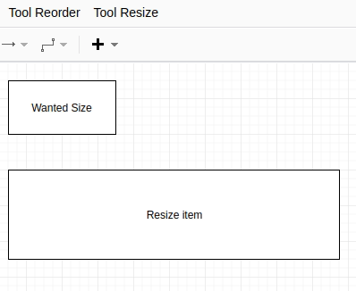
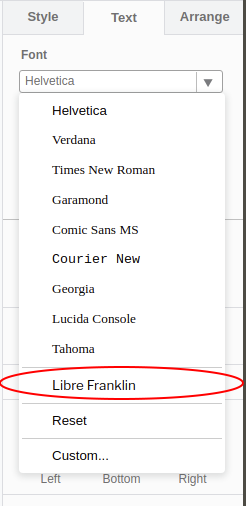
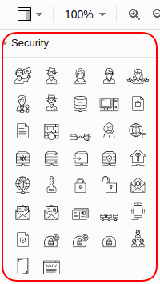

 # Index:

<!-- TOC -->

- [1. Plugins:](#1-plugins)
    - [1.1. Resize (height & width by selected cell)](#11-resize-height--width-by-selected-cell)
    - [1.2. ReOrder Childeren](#12-reorder-childeren)
    - [1.3. Google Fonts](#13-google-fonts)
    - [1.4. SecurIT Huisstijl](#14-securit-huisstijl)
    - [1.5. Kubernetes K8 Icons](#15-kubernetes-k8-icons)
    - [1.6. Security Icons](#16-security-icons)
    - [1.7. Explore (WIP)](#17-explore-wip)
- [2. Install Plugin Within Draw-io](#2-install-plugin-within-draw-io)
    - [2.1. Use of CORS Proxy:](#21-use-of-cors-proxy)
        - [2.1.1. Cors Proxy information:](#211-cors-proxy-information)
    - [2.2. Installation Steps (draw.io Online)](#22-installation-steps-drawio-online)
    - [2.3. For windows/macOS/linux draw.io desktop:](#23-for-windowsmacoslinux-drawio-desktop)

<!-- /TOC -->

# 1. Plugins:

## 1.1. Resize (height & width by selected cell)
This plugin enables u to resize a object within draw.io. To use it, select the object that is the right size(height & width), then select: `Tool Resize` -> `Resize`. All the same objects(same style as selected cell) will be resize to the same size of the selected object.

  

- Plugin URL: https://yacdn.org/serve/https://raw.githubusercontent.com/CoolZeroNL/draw-io-plugins/master/%23%20Draw-io-plugin-ReSize/draw-io-plugin-resize-v1.js?maxAge=10

## 1.2. ReOrder Childeren
This plugin enables u to reorder childeren of a root object within draw.io. To use it, select the root cell with the childeren you want to reoder, then select: `Tool Reorder` -> `Reorder`. All the childeren will now be Reodered under the root cell.

  

- Plugin URL: https://yacdn.org/serve/https://raw.githubusercontent.com/CoolZeroNL/draw-io-plugins/master/%23%20Draw-io-plugin-ReOrder/draw-io-plugin-reorder-childeren-v3.js?maxAge=10

## 1.3. Google Fonts
<!-- https://github.com/jgraph/drawio/issues/577 -->
This plugin enables you the use of all the google fonts within draw.io.

I have added to the custom fonts "Roboto", "Open Sans" & "Libre Franklin". But you can load more if u want by entering the name of the font family in the `Font` -> `Custom...` option.

- Plugin URL: https://yacdn.org/serve/https://raw.githubusercontent.com/CoolZeroNL/draw-io-plugins/master/%23%20Draw-io-plugin-Google-Fonts/google-fonts-v1.js?maxAge=10
  
  - Will do:
    - Install all Google Fonts into Browser

  - Load Custom Fonts: 
    - Libre Franklin
    - Roboto
    - Open Sans

    For the complete list of fonts: [List of Google Fonts](https://github.com/CoolZeroNL/draw-io-plugins/blob/master/%23%20Draw-io-plugin-Google-Fonts/googleFonts.json) or [fonts.google.com](https://fonts.google.com)   
    ** note that not all the fonts will work in draw.io.. like: Libre Barcode

    

      
    

## 1.4. SecurIT Huisstijl
<!-- 
- more information: https://github.com/holroy/draw.io-plugins/wiki/Dissected-Example-Plugin
- more information: https://code.greenhost.net/totem/ind/tree/ca8b1b90ad23b8fa1800b8e055a7ee3bd9df9bb8/grapheditorxblock/src/stencils 
- more information: https://yacdn.org/serve/https://gist.githubusercontent.com/lindapadilla/5974598/raw/0c80ac0f4d03234bffb50cb14eda0a9b23f6e07a/customizeBPMN
-->

- Plugin URL: https://yacdn.org/serve/https://raw.githubusercontent.com/CoolZeroNL/draw-io-plugins/master/%23%20Draw-io-plugin-SecurIT/draw-io-plugin-securit-huisstyle-v1.js?maxAge=10

  - Will Do:
    - Add Stencil: 
      - SecurIT
      - Security
      
    - Load Custom Font: 
      - Libre Franklin

    

      
      
    

## 1.5. Kubernetes K8 Icons

<!-- Load SVG from RAW by `?sanitize=true` -->
<!-- https://raw.githubusercontent.com/CoolZeroNL/draw-io-plugins/master/%23%20Draw-io-plugin-SecurIT/securit.huisstyle.images/security_isp-server.svg?sanitize=true -->

<!-- https://github.com/jgraph/drawio/issues/569 -->

- Plugin URL: https://yacdn.org/serve/https://raw.githubusercontent.com/CoolZeroNL/draw-io-plugins/master/%23%20Draw-io-plugin-K8-Icons/draw-io-plugin-k8-icons-v1.js?maxAge=10

  - Will Do:
    - Add Stencil: 
      - Kubernetes K8 Icons
      
    

      
    

## 1.6. Security Icons

- Plugin URL: https://yacdn.org/serve/https://raw.githubusercontent.com/CoolZeroNL/draw-io-plugins/master/%23%20Draw-io-plugin-Security-Icons/draw-io-plugin-security-icons-v1.js?maxAge=10

  - Will Do:
    - Add Stencil: 
      - Security Icons
      
    

      
    

## 1.7. Explore (WIP)

- Plugin URL: https://yacdn.org/serve/https://raw.githubusercontent.com/CoolZeroNL/draw-io-plugins/master/%23%20Draw-io-plugin-Explore/draw-io-plugin-explore-v1.js?maxAge=10

  - Todo:
    - [] add link as url in cell ( is now as tooltip )

# 2. Install Plugin Within Draw-io

## 2.1. Use of CORS Proxy:
Because the plugins are been included within draw.io the browser will block this, because the plugin is not on the same domain as draw.io is. So the browser will give the next error: `Refused to execute script from 'https://raw.githubusercontent.com/CoolZeroNL/draw-io-plugins/master/draw-io-plugin-resize.js' because its MIME type ('text/plain') is not executable, and strict MIME type checking is enabled.` 

To fix this u need to use a CORS proxy server, and the urls are:

`https://yacdn.org/serve/ {raw.githubusercontent.com url} ?maxAge=10`

### 2.1.1. Cors Proxy information:
https://ovsoinc.github.io/yacdn.org/

## 2.2. Installation Steps (draw.io Online)
To add a new plugin, do the next steps:

Go to `Extras` -> `Plugins`
kbd:[File] -> kbd:[Save] -> kbd:[Option]

  

Click on `Add`

  

Paste the url of the wanted Plugin and click on `Add`

  

If you are done adding your wanted plugins, click `Apply`

  

You will get a warning, click `Ok` and refresh your draw.io page.

  

When using custom plugins, you will get a warning every times you open Draw.io, check if the plugin you want is listed here, and press `Ok`

  

Now you see a extra menu item `Tool XX`. As a sub item the plugin functionality will be availible.

  

## 2.3. For windows/macOS/linux draw.io desktop:

0. download Draw.io from the next location: https://about.draw.io/integrations/#integrations_offline

1. Download plugin file. eg: /Users/xxx/plugins/plugin.js
2. Add plugin in Plugin Panel
URL: file:///Users/{username}/plugins/plugin.js
3. Apply and restart.

** Note that the plugins that load the resource fromt the inet dont work in the desktop version of Draw.io because the content is been block du security reasons.

<!-- 
 3. Distribution:

 3.1. Plugin: securit
- Kyam

 3.2. Plugin: Resize
- Rogier
- Stefan
- Peter
- Abdel 
-->
